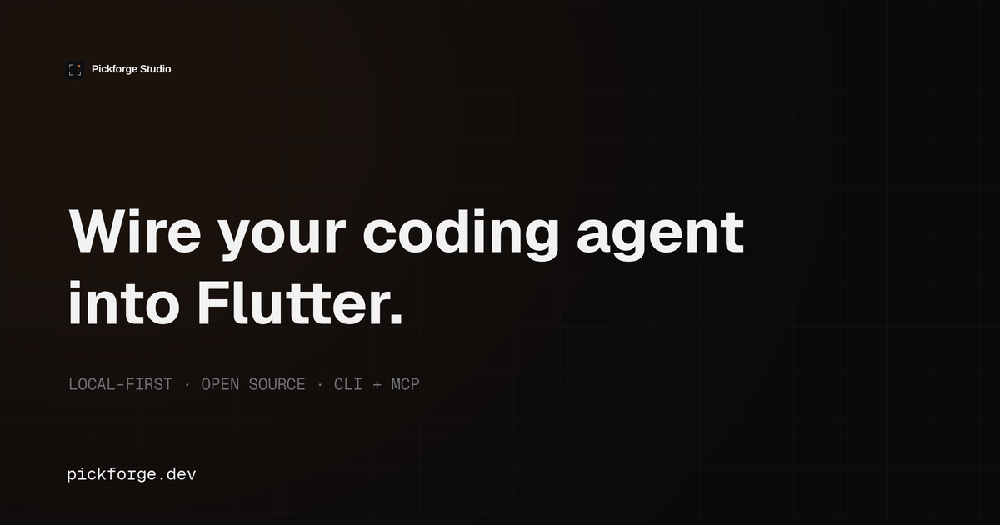

Local-first. Open source. Built for people who ship.

### Wire your coding agent into Flutter.

[Pickforge](https://github.com/pickforge/pickforge) connects Claude Code, Codex, and Pi to Flutter, with a Linux lab for running and testing real apps.

Run isolated desktop sessions, automate Android emulators, and inspect what happened through screenshots, logs, and recorded evidence.

CLI + MCP server. Flutter first. Formerly PickLab.

[Get started](https://pickforge.dev/pickforge) · [Source](https://github.com/pickforge/pickforge)

### Also from the workshop

[PickCheck](https://github.com/pickforge/complexity-gate) checks function complexity inside your coding agent’s workflow, before complicated code becomes your maintenance problem.

---

[pickforge.dev](https://pickforge.dev) · [@pickforgedotdev](https://x.com/pickforgedotdev)
